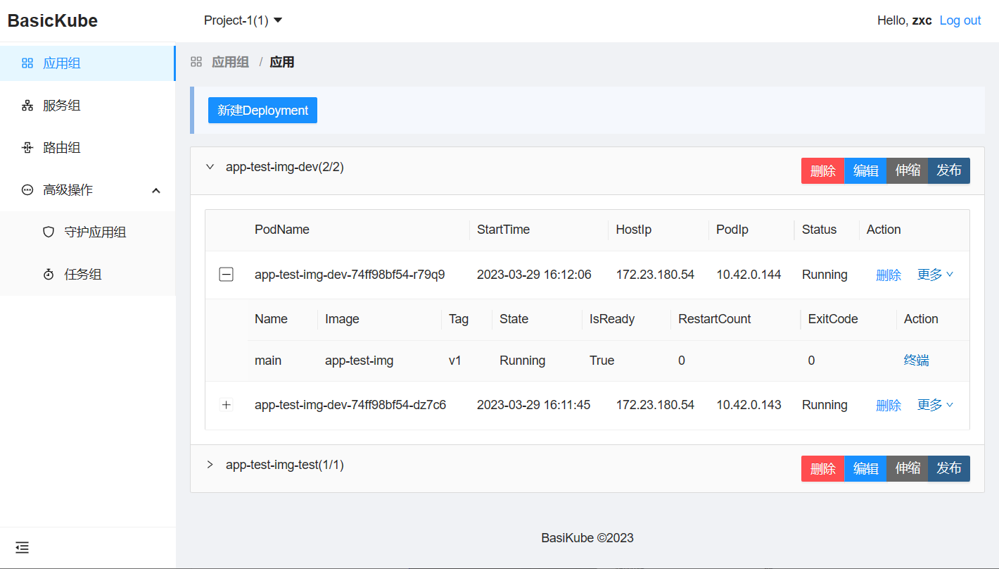
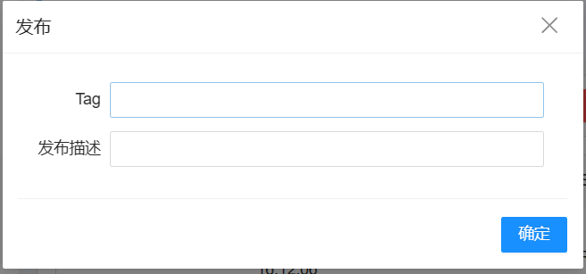
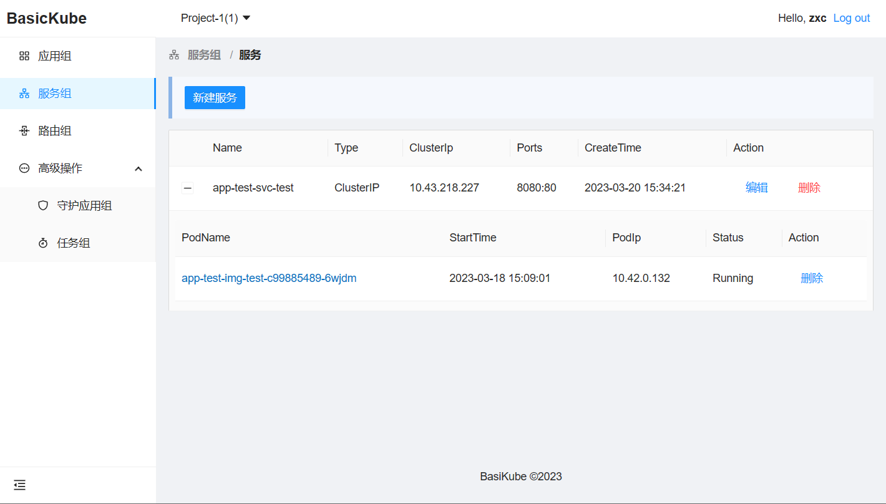
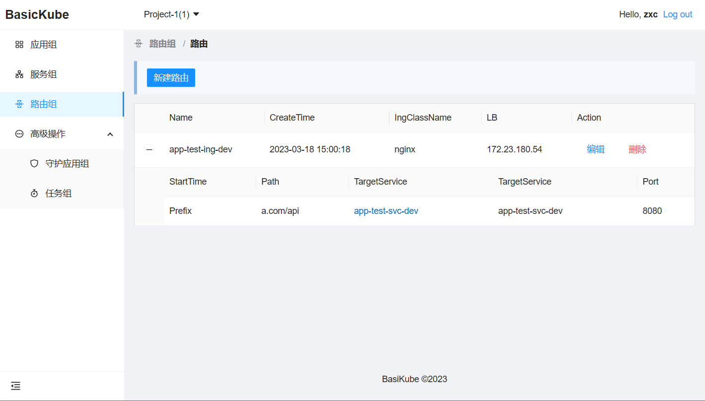
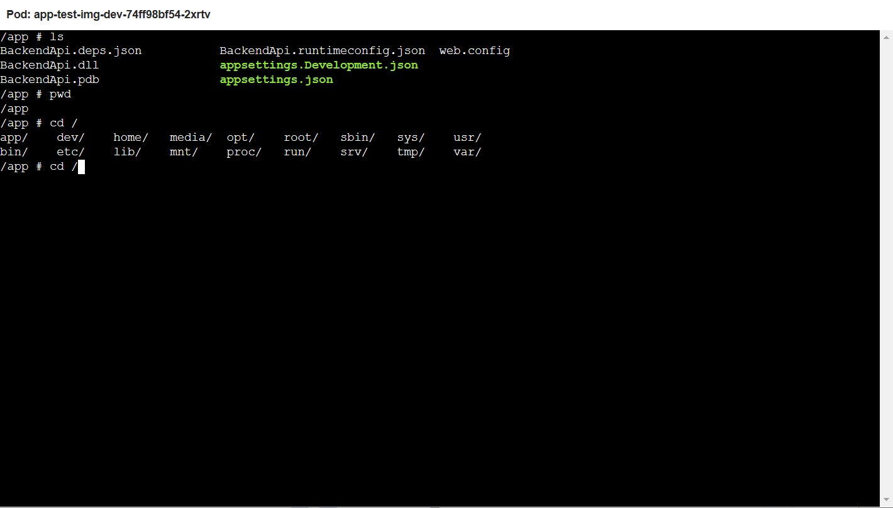
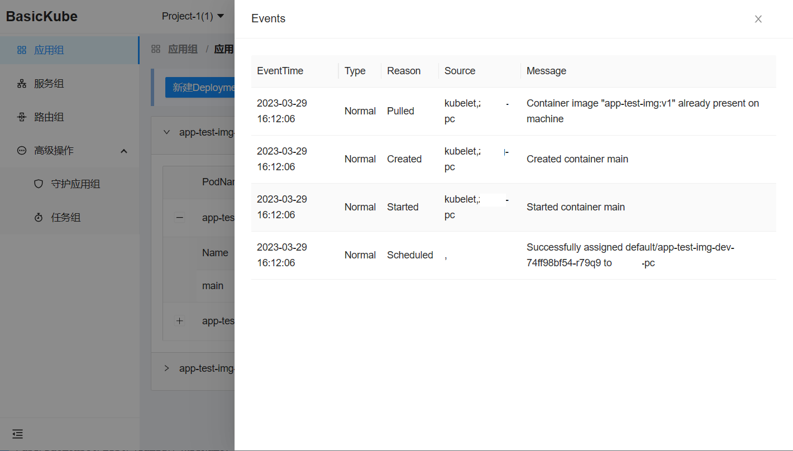
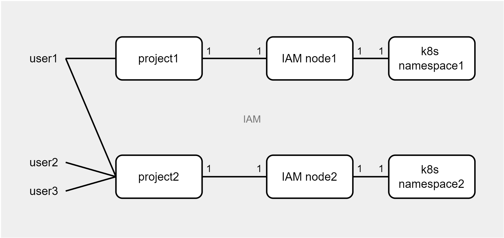

# BasicKube

一个面向业务开发的k8s基础UI系统，非开箱即用，不适用于对K8s集群进行管理操作。

# 功能

## 环境和组

支持对资源进行环境划分：开发环境、测试环境、预发布环境、线上环境。不同环境的同一个服务或资源形成“组”。



## K8s 基础功能支持

支持对以下 K8s 资源增删改查的**基本**操作。

1. - [x] Deployment
   - - [x] 主容器镜像发布
       
   - - [x] 伸缩
2. - [x] Service
     
3. - [x] Ingress
     
4. - [x] DaemonSet
5. - [x] Job
6. - [ ] CronJob

> **Note**
>
> 在 BasicKube 中，Deployment 组又被称为应用组。应用广义上包含 Deployment、DaemonSet 等，在 BasicKube 中，在没有明确说明下，应用仅代指 Deployment。

## Pod 终端

BasicKube 提供一个 Web 终端，可以用来连接容器，对 Pod 进行操作。



## Pod 事件查看



# 配置

## IAM

IAM（身份验证和访问管理）受 AWS IAM 启发，用于在 k8s 集群上控制用户的命名空间权限。

### 设计理念

1. 通过关联一个 IAM 节点，可以将一个项目与一个 k8s 命名空间相关联。
2. 一个项目可以有多个用户，一个用户也可在在多个项目下。



### 配置IAM和命名空间的映射

1. 打开 `appsettings.json` 文件
2.  添加 `K8s:NameSpaceMap` 选项:

```json
{
  "Logging": {
    ...
  },
  "K8s": {
+    "NameSpaceMap": {
      "1": "default"
    }
  }
}
```

在 `K8s:NameSpaceMapg` 中，key 是 IAM 节点, 值是 k8s 的命名空间。

## K8s集群配置

1. 在 `BasicKube.Api/configs` 目录下添加K8s的配置文件
2. 添加  `K8s:ClusterConfig` 配置项：

```json
{
  "K8s": {
    "NameSpaceMap": {
      ...
    },
+    "ClusterConfig": {
      "dev": "./configs/k8s-cluster-config-dev",
      "test": "./configs/k8s-cluster-config-default",
      "staging": "./configs/k8s-cluster-config-default",
      "prod": "./configs/k8s-cluster-config-default"
    }
  }
}
```

在 `K8s:ClusterConfig ` 配置项中，key 是环境名，value 是k8s集群的配置文件。

## 外部账号系统集成

BasicKube 中不涉及账号系统，需要通过 `AccountController` 和现有的账号体系进行集成。`AccountController` 位于`BasicKube.Api/Controllers/Account` 目录下。

# 协议

禁止商业使用，对个人学习或其他使用，参考MIT协议。

# OS

1. ASP.NET Core full-stack
2. Ant Design Blazor
3. KubernetesClient
4. Blazored.*
5. Serilog.*
6. ...

