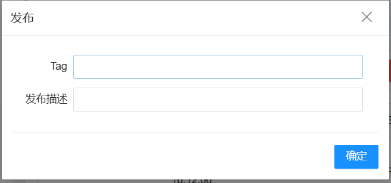
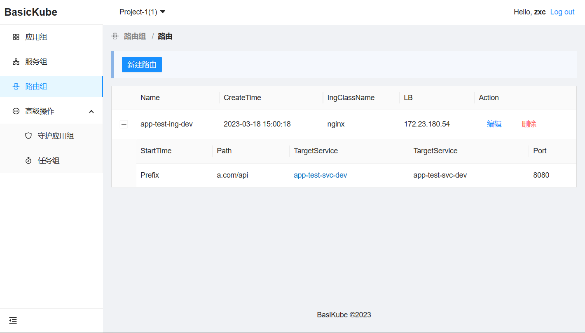
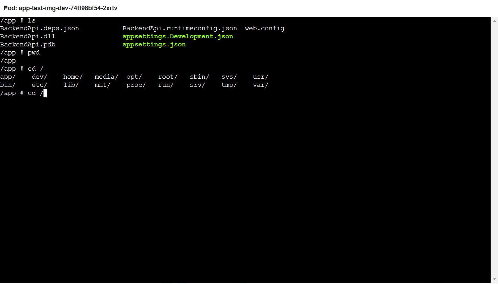
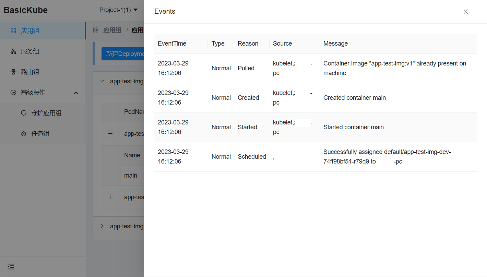

# BasicKube

A non-out-of-the-box basic k8s UI for business developers, not suitable for managing K8s clusters.

# Features

## Environment and Group

Support for environment-based resource partitioning: development environment, testing environment, staging environment, and production environment.

The same service or resource in different environments forms a "**group**".


## Basic operations in Kubernetes:

Support basic CRUD (create, read, update, delete) operations for the following K8s resources:

1. - [x] Deployment
   - - [x] Publishing the main container image of a Pod
   - - [x] Scaling
2. - [x] Service
     
3. - [x] Ingress
     
4. - [x] DaemonSet
5. - [x] Job

> **note**：
> In BasicKube, the Deployment group is also referred to as the Application group. In a broad sense, an application includes Deployment, DaemonSet, and so on. However, in BasicKube, when not explicitly stated, the term "application" refers only to Deployment.

## Pod Container Terminal

BasicKube provides a web terminal that can be used to connect to containers and perform operations on Pods.



## Viewing Pod events.



# Configuration

## IAM

Identity and Access Management(IAM) inspired by AWS IAM, used to control user permissions on the k8s namespace.

### Design concept

1. One project is associated with a namespace by associating an IAM node. 
2. A project can contain multiple users, and a user can also be under multiple projects.


### Configure the mapping of IAM node and namespace

1. Open `appsettings.json` file
2.  Add `K8s:NameSpaceMap` configuration:

```json
{
  "Logging": {
    ...
  },
  "K8s": {
+    "NameSpaceMap": {
      "1": "default"
    }
  }
}
```

In the section `K8s:NameSpaceMapg`，key is the IAM node, and the value is k8s namespace.

## K8s cluster configuration

1. Add the configuration file for the k8s cluster under directory `BasicKube.Api/configs`
2. Set the **mapping between the environment and the k8s cluster** in the `appsettings.json` file. The section is `K8s:ClusterConfig`:

```json
{
  "K8s": {
    "NameSpaceMap": {
      ...
    },
+    "ClusterConfig": {
      "dev": "./configs/k8s-cluster-config-dev",
      "test": "./configs/k8s-cluster-config-default",
      "staging": "./configs/k8s-cluster-config-default",
      "prod": "./configs/k8s-cluster-config-default"
    }
  }
}
```

In the section `K8s:ClusterConfig`，key is the environment name, and the value is the configuration file for the k8s cluster .

## External account system integration

There is no account system function in BasicKube, it needs to be integrated with the existing account system in `AccountController`, which is under `BasicKube.Api/Controllers/Account`.

# License

Prohibition of commercial use, with reference to the MIT license for personal learning or other uses.

# OS Reference

1. ASP.NET Core full-stack
2. Ant Design Blazor
3. KubernetesClient
4. Blazored.*
5. Serilog.*
6. ...
